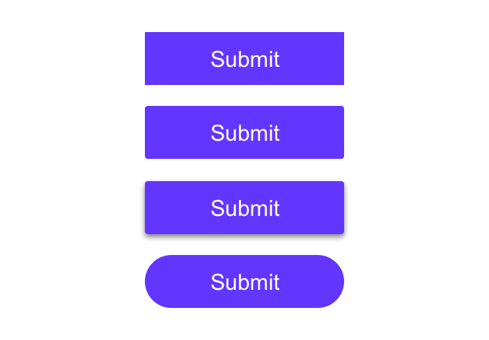
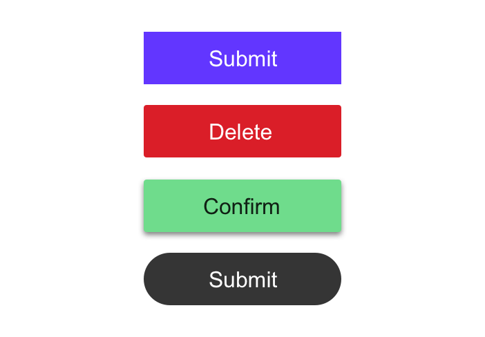
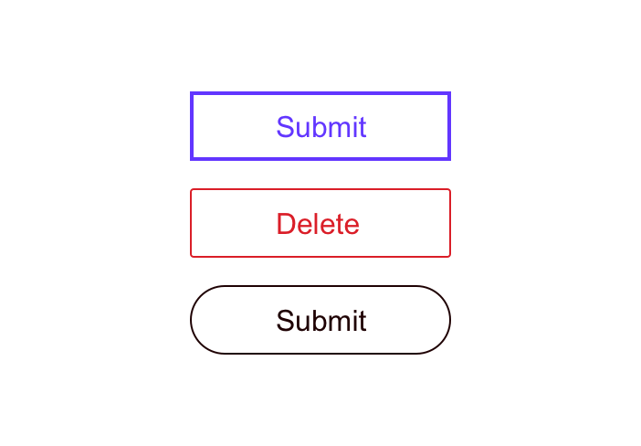
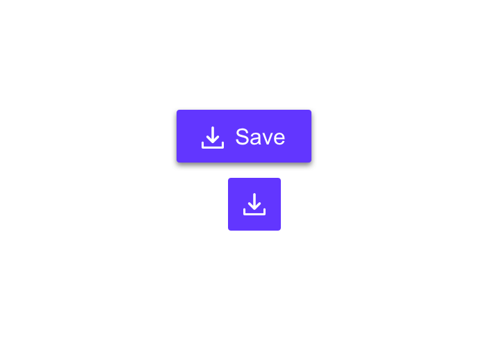
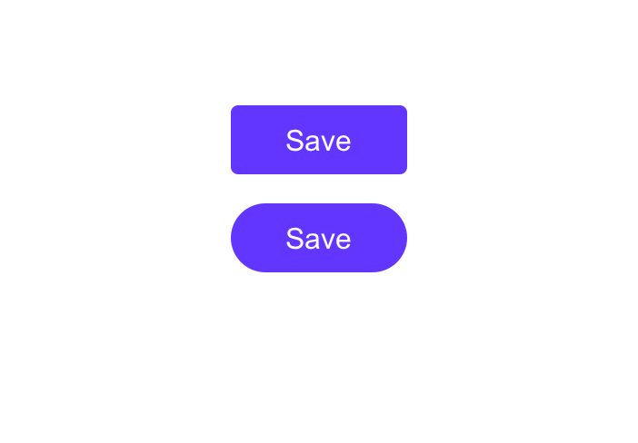
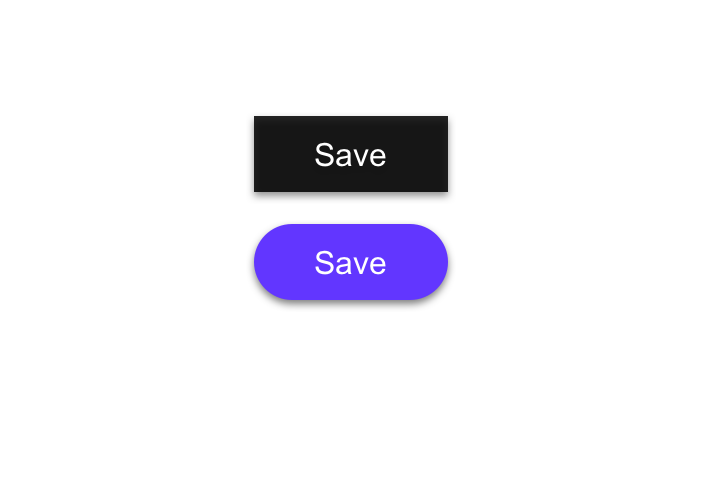
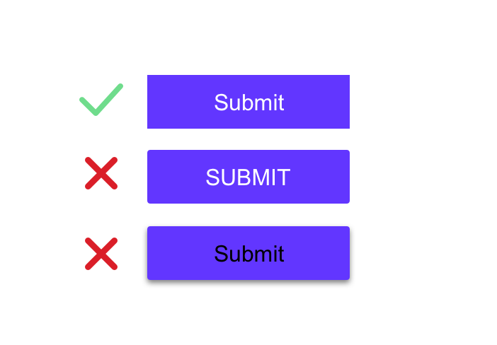
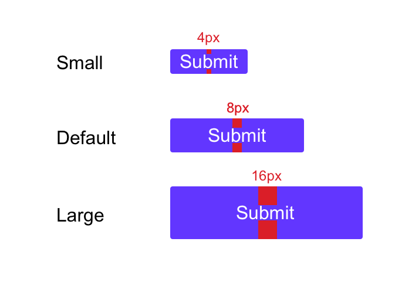
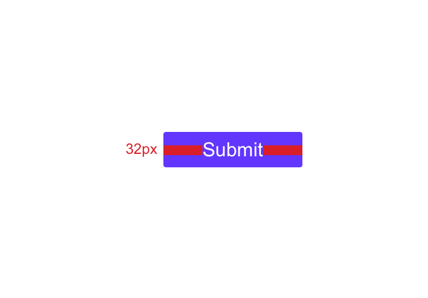

# Designing Components With Figma

We're finally ready to begin designing our components! First we'll build a button component in all of its variations and states. Then we'll build a composite component, a component comprised of other components, a modal!

## Button States

There are many factors that go into building a button. We touched upon these earlier but here are the use cases we'll cover:

- Primary
- Secondary
- Tertiary
- Primary with icon
- Secondary with icon
- Tertiary with icon
- Icon button
- Disabled
- Neutral
- Hover
- Focus
- Active / pressed
- Small
- Default
- Large
- Warning
- Error
- Success

Buttons should be labeled with what they do and it should be clear what action clicking the button will trigger.

A modal asking 'Do you want to delete this document' with two buttons labeled 'Okay' and 'Cancel' might at first glance seem sufficient, but the 'Okay' label leaves something to be desired.

Instead you should label the button with 'Delete' and give it error styling.

## Types Of Buttons

There are several different types of buttons and each of these conveys a hierarchy.

Primary buttons should be used for the most important action on a page (i.e. log in, submit).

Secondary buttons should be used for content which, while still important, won't trigger the highest-priority action on the page. You may want to use secondary buttons for navigating to other content on the page.

Tertiary buttons are used for miscellaneous actions; actions which are not something the user needs to do at that given second. This might be an action like 'Read more' on a blog post.

## Button Styles

There are many styles you can use to convey your button hierarchy.

Your buttons should look and function like a button.

Here are some common button patterns which are familiar to most users.



### Solid Buttons

Solid buttons are buttons with a solid background fill. They're easily recognizable and a great choice for a primary button.



### Line / Ghost Buttons

Ghost buttons are buttons without a background fill; they only have an outline.



### Icon Buttons

Icon buttons have no label and are only an icon. Keep in mind that buttons and icons without a label are bad for accessibility and if a label can be used it should.

However, if you do choose to forgo the label, be sure to include an `aria-label` attribute on the button explaining the action that will be completed when triggered and not an explanation of what the icon is.



### Border Radius

You may choose to have a button with 90 degree squared edges, a partial border-radius, or a full border-radius and it will impact your brand identity.

Rounded buttons are more playful than buttons with squared edges. Your button design should coincide with your brand identity.



### Drop Shadow

You may also choose to add a drop shadow to your button which will elevate it off the page. You can add a drop shadow, or box shadow, to a button on hover or focus as well.



### Label Style

When choosing your label style, be sure you place readability above all else. While uppercase-text buttons look modern, they are often harder for users to read, so you should choose sentence-case over uppercase.

You also need to ensure that you have sufficient color contrast between the label and the button.

Lastly, use a font-weight which is legible.



### Vertical Padding

You must ensure your buttons are large enough to be accessible and clickable on a mobile device. Instead of stating a hard-coded height for your button, add vertical padding. This will allow the browser to change the text size (for visually impaired users) without cutting off the text.

Vertical padding of `16px` is a great option for a large button, `8px` for a default button, and `4px` for a small button.



### Horizontal Padding

To keep your buttons responsive, you can add horizontal padding. You can additionally add a `min-width` property so you don't get tiny buttons.

For example, `32px` of padding on the left and right side of the button with a `min-width` of `100px` is a great option.



## Building A Button

Let's design our default primary, secondary, and tertiary buttons.

I've created a Figma starter kit for you to copy. You can grab it [here](https://www.figma.com/file/FUgY11amAHtmR2zyiHcSYs/FEM-Template?node-id=0%3A1), copy and paste it into a new project.

Our primary button will be a filled button which uses our primary color (primary-300) and will use either black or white text depending upon color contrast ratios.

Our secondary button will be either a ghost button or a filled button having a lighter version of our primary color.

Our tertiary button will be the button label without a background color or outline.

In the Figma starter you cloned I've created a table with the following axes. It's your job to fill it in with button designs!

### X-Axis Labels

- Default
- Hover
- Focus
- Active
- Disabled

### Y-Axis Labels

- Primary
- Secondary
- Tertiary
- Large
- Small
- Icon (no text)
- Labelled icon
- Warning
- Error
- Success

We haven't defined colors for warning, success, and error so you can use the following HEX codes.

```
Warning: #fddb3a (black text)
Error: #fa4d56 (black text)
Success: #6fdc8c (black text)
```

Use the following values for your buttons:

```
Large button vertical padding: 16px
Default button vertical padding: 8px
Small button vertical padding: 8px

Large button horizontal padding: 24px
Default button horizontal padding: 12px
Small button horizontal padding: 8px

Large button minimum width: 125px
Default button minimum width: 100px
Small button minimum width: 75px

Large button icon size: 24 x 24
Default button icon size: 16 x 16
Small button icon size: 8 x 8

8px padding right between the icon and the button text
```

You can choose the button styles that you like (filled versus ghost, border radius, text style).

We will use the save icon from [The Noun Project](https://thenounproject.com/search/?q=save&i=2209758) to create our icon buttons. Click 'Get this icon' and select basic download. Then download the SVG. You can drag the downloaded SVG into Figma.

Take the next 30 minutes and design your buttons in Sigma

Once completed, right click on your default elements (primary, secondary, tertiary, etc.) and click "Create component." You can also select the component and type "option + command + k" on a Mac as a shortcut.

You can additionally add a component description in the right-hand sidebar.

Then on the left sidebar click "Assets" and you should see your components there.

## Creating A Modal

Now we'll create a composite component, which is a component comprised of other components.

Create a new page in Figma called "Modals" and add an art board.

A modal can contain several different elements but typically has a close button in the upper right-hand corner, some modal content, and an action to complete.

Let's build a dialog which informs the user that they can create an account to access more features.

It will contain a close button (X) in the top right corner, an illustration, a title (Sign up), and a paragraph containing the following text: "Sign up today to get access to all of our content and features!"

It will also contain a button at the bottom: a primary button (Sign up).

For the illustration we'll use [Undraw.co](https://undraw.co/illustrations) which is my favorite website to grab illustrations from.

I'll use the "Mobile Login" illustration but feel free to choose any illustration. In the top right corner, add a shade from your primary color palette so it fits with your color scheme.

Save the illustration as an SVG and drag it into Figma.

Press "R" to draw a rectangle and give it a reasonable modal width and height. I chose a width and height of 800px by 580px.

Give the rectangle a background color of `neutral-100` and click "Effects" to add a drop shadow.

Click the sun icon on the left to change the box shadow.

Give it a blur of 16, x of 0, and y of 5. Set the opacity to 20%.

Head over to the [Noun Project](https://thenounproject.com/) and download the SVG version for a close icon. Drag that into Figma.

Give it the color `neutral-400` and resize it to approximately 24px x 24px. Position in the top right corner, 40px from the top and right modal edges.

The illustration should be approximately 280px in height and be placed in the vertical center of the modal 64 from the top.

The illustration should be 32px from the title. The title should be an `h3` and the header, paragraph, and button should be `16px` from each other.

Next, I want you to create one more modal which uses some of the components we've made. I've also included a "Text Fields" page in the Figma kit which you can use for your mockups.

If you need inspiration I suggest [Dribbble](dribbble.com/).

## Resources

- [Material Design buttons](https://material.io/components/buttons/#outlined-button)
