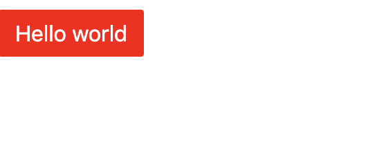
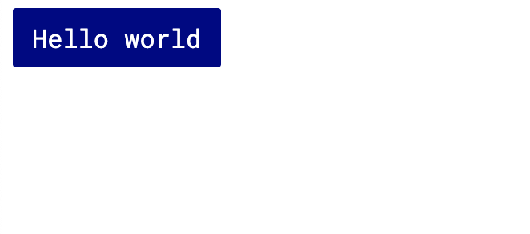
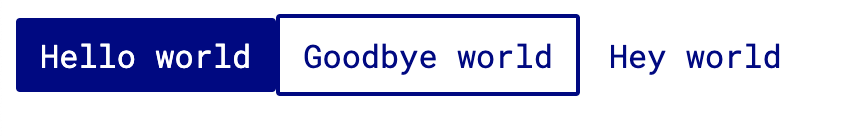
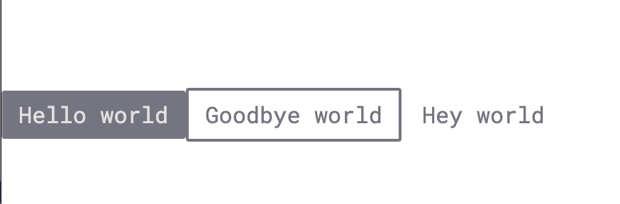
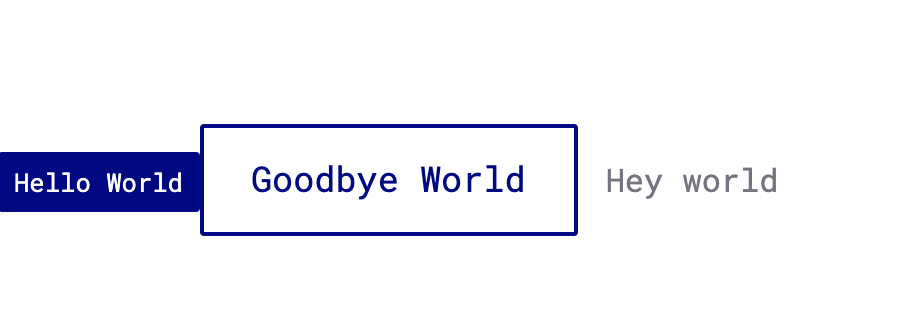
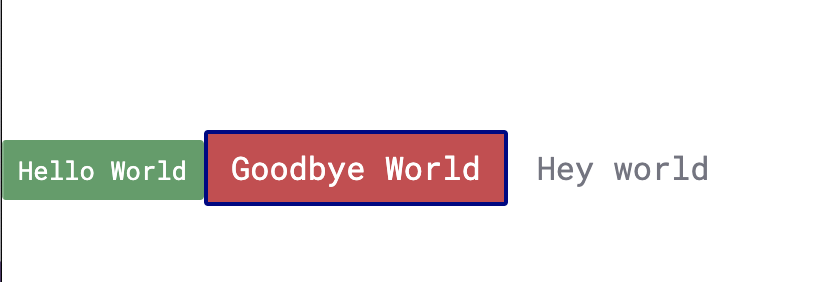
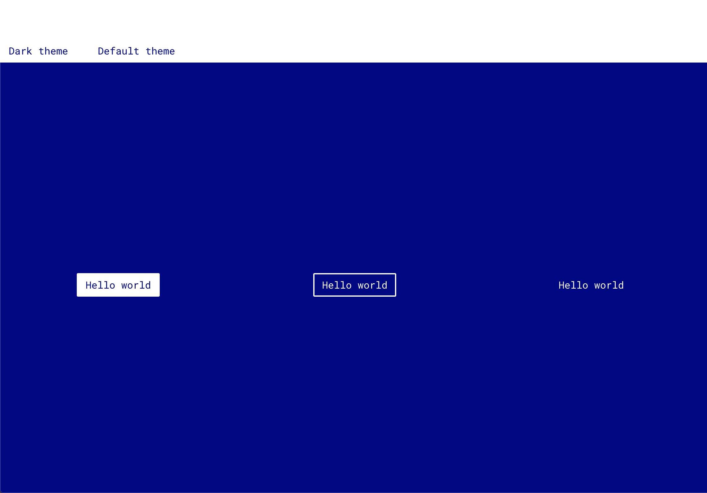
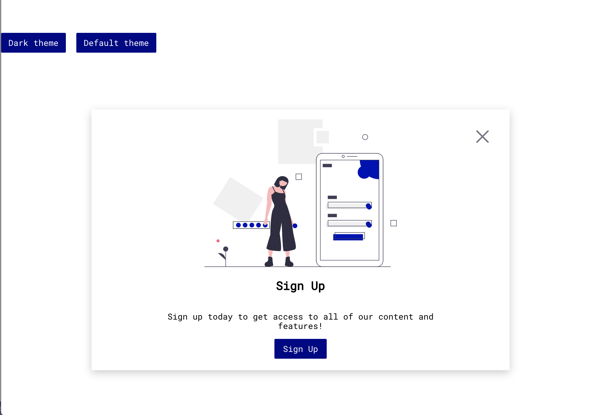
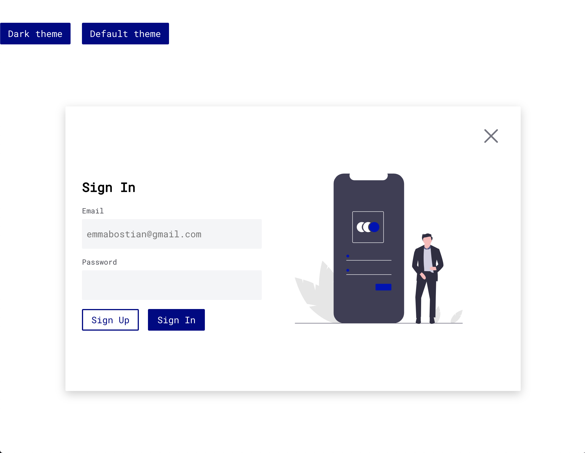

# Developing Reusable Components With React Styled Components

If you've never worked with CSS-in-JS before, the paradigm shift can be a bit overwhelming.

Admittedly it took me quite a while to come to terms with the new syntax, but once I opened up my mind to the new structure I quickly realized the benefits that CSS-in-JS has for component libraries.

## CSS-in-JS

When we think about how we style our apps, CSS is probably the first thing that comes to mind. CSS, or Cascading Style Sheets, is the language we use to apply styles to HTML DOM elements.

In the past we would apply CSS in three ways:

- External CSS stylesheet with a `link` in the `head` HTML element
- Within the HTML file in a `<style>` tag
- Inline on the HTML elements `<h1 style="margin-right: 4px">`

And while this worked for a while, some problems began to arise.

CSS is not a scoped language, meaning its styles can bleed out from one component file and unintentionally affect the styling of unrelated components. This is due to CSS specificity rules which are a point system that governs how CSS styles are applied.

### CSS Specificity

There are three buckets of CSS specificity:

1. Type selectors and pseudo-elements
2. Class selectors, attribute selectors, and pseudo-classes
3. ID selectors

```css
/* Type selectors and pseudo-elements */
h1 {
  ...;
}

h1::before {
  ...;
}

/* Class selectors, attribute selectors, and pseudo-classes */
.cat {
  ...;
}

input[type="radio"] {
  ...;
}

h1:hover {
  ...;
}

/* ID selectors */
#cat {
  ...;
}
```

Universal selectors, such as \*, combinators, such as > and +, and negation of pseudo-classes, such as `:not()` have no effect on CSS specificity (however the styles inside of the `not()` pseudo-class do).

Inline styling, styles added directly to the HTML element, will always override any styles declared in an external stylesheet and this is generally bad practice.

Lastly, `!important` statements override all styling.

### Problems With CSS

So... why is pure CSS problematic?

The ability to include styling in so many ways (inline, in the document head, and in external CSS files) causes our styling to be de-centralized and difficult to maintain. De-centralized CSS makes it difficult to remove old CSS when a component is removed and this can lead to dead code bloating your package size.

Additionally, a lack of knowledge about CSS specificity leades developers to add `!important` notations to many styles, which leads to unmaintainable styling. This also leads to bleeding styles.

For example, if I want to color all list items in my "Shopping cart" component blue, I might write the following CSS inside of `shopping-cart.css`:

```css
li {
  color: blue;
}
```

While this might seem to work at first glance, this style will be applied to ALL list items in the application, which I don't want. I can try to make this more specific with one of the following CSS declarations:

```css
ul.shopping-cart > li {
  color: blue;
}

li.shopping-cart-item {
  color: blue !important;
}

.shopping-cart > .shopping-cart-item {
  color: blue;
}

.shopping-cart-item {
  color: blue;
}
```

None of these is particularly great and can lead to difficult-to-read CSS styling and a multitude of HTML class names.

To combat this, CSS naming architectures were created.

### CSS Naming Architectures

CSS naming architectures, like SMAACS and BEM (block-element-modifier) were created to superficially scope CSS styling. However, they were... superficial. This means that they are simply a naming convention for developers to create more scoped styling, and wouldn't actually prevent leaked styling.

With BEM our shopping cart CSS styles might look more like this. The block is the shopping cart, the element is the shopping cart item, and the modifier might be something like an out of stock indicator.

```css
.shopping-cart__shopping-cart-item {
  color: blue;
}

.shopping-cart__shopping-cart-item--out-of-stock {
  color: red;
}
```

And while this might have helped bleeding CSS styling, you can see that the names quickly became long and unruly. As a result, CSS naming architectures didn't truly solve the issue of bleeding styles.

### CSS Pre-Processors

Next came CSS pre-processors like [Sass](https://sass-lang.com/) and [Less](http://lesscss.org/). These pre-processors provided styling capabilities such as nesting, mixins, and more which allow more control over how our CSS styles are applied.

Our shopping cart component might look more like this:

```scss
.shopping-cart {
  &__item {
    color: blue;

    &--selected {
      color: red;
    }
  }
}
```

Sass nesting plays really nicely with the BEM naming architecture and was a viable solution for many large-scale applications. But then a new solution arose which changed how we build components: CSS-in-JS

### CSS-in-JS

CSS-in-JS is a styling technique where JavaScript is used to style our components. When the components are parsed, CSS is generated and attached to the DOM.

CSS-in-JS prevents style leaking that we saw with plain CSS and CSS naming conventions, and is an alternative to CSS pre-processors. It also allows you to encapsulate styling within a component, which is great for component libraries.

There are several popular CSS-in-JS libraries:

- [Emotion](https://emotion.sh/docs/introduction)
- [Styled Components](https://emotion.sh/docs/introduction)
- [JSS](https://cssinjs.org/?v=v10.0.4)

## Styled Components

There are several different CSS-in-JS libraries, but the one we'll be using today is [styled components](https://styled-components.com/).

Styled components provides many benefits, like scoped styling (no more worrying about bleeding CSS specificity or rogue `!importants`).

## Application Architecture & Workflow

We're going to build our components using [create-react-app](https://github.com/facebook/create-react-app).

**I wouldn't condone using `create-react-app` under normal circumstances if you're building an enterprise design system; this tool is great for building React _applications_ but not for creating component libraries.**

So then, you might ask, why are we using it today?

Well, my friends, building a component library is not cut-and-dry. It requires a lot of setup and knowledge about how to build a component library while being able to observe and test the changes in real-time.

We have a few options when it comes to building components and observing them in real-time.

### Write our code, build our package, publish to the npm registry, install our package in a React application, and see if it works.

This option isn't optimal as it doesn't allow us to view our components as we're building them.

### Create a mono repository, a project where many projects or packages are stored in the same repo.

This would require taking the time to set up [Yarn workspaces](https://classic.yarnpkg.com/en/docs/workspaces/) and [Lerna](https://github.com/lerna/lerna).

**This is the architecture you might want if you are building a component library within a company (especially if you have multiple products using the same system). It is the most robust solution and easily manageable. It also has several benefits including smart dependency management (it will only install one version of an npm package even if used in all containing repos).**

Unfortunately I _don't_ have experience with either of these technologies and would consume a lot of time trying to troubleshoot and set up.

There was a library I attempted, and hoped, to use for this workshop called `create-react-library`, which you can check out [here](https://www.npmjs.com/package/create-react-library), but unfortunately getting it to work with styled components was a hassle and many of the dependent packages were sorely deprecated.

If they update this library to use the newest version of React, this is the solution I would opt for!

If there's a future version of this workshop, I would love to include the setup of a monorepo, but I simply didn't have time!

### Use `create-react-app` to build and test our components.

I recognize that this option is not ideal, and learning how to publish our component library today would be extremely valuable but due to the time constraint and my lack of knowledge in this area, as well as each company having individualized build and deployment processes, I opted to keep this part out of the workshop.

This will allow us to focus on the content and not on the process.

## Editor Settings

At the time of this recording I am using the [Dank Mono](https://dank.sh/) font, which is a paid font for 40 GBP, however you can use [Fira Code](https://github.com/tonsky/FiraCode) if you're looking for something similar, with font ligatures, for free!

I am also using the VS Code color theme [Dracula](https://draculatheme.com/visual-studio-code/).

## Application Setup

Open your terminal and change directories to the place you want to house your project. I'll save mine to my desktop.

```
cd Desktop
```

Then use `create-react-app` to create a new React application. I use [`npx`](https://nodejs.dev/the-npx-nodejs-package-runner), node.js package runner to use `create-react-app`.

This is a great tool because it allows you to leverage tools without installing them and you can run different versions of the packages with the `@version` prompt.

Once in your desired location, run the following commands to create a new project.

`npx` is a great feature that comes with `npm >= 5.2.0`, so if you're on a lower `npm` version, I recommend updating.

```js
npx create-react-app my-component-library && cd my-component-library
```

I am then going to open my React application in my editor of choice: [VS Code](https://code.visualstudio.com/docs/editor/command-line).

I use the command `code .` to open the current project in VSCode. You can install the VSCode command line interface (CLI) [here](https://code.visualstudio.com/docs/editor/command-line) if you'd also like this functionality!

Once VSCode is open I prefer to use the integrated terminal. You can open this by clicking control + back tick on Mac, or by going to the View menu and clicking Terminal.

## Removing Boilerplate

Before we run our React application, let's remove some of the boilerplate.

Remove everything inside of the `src/` folder.

Now let's add a new file inside of the `src/` folder called `index.js`.

(You can also manually delete all of these files if you don't feel like re-adding them, however I think it's good to walk through the process and saves me a bit more time as opposed to manually deleting each individual file).

Let's just add a simple `App` component which returns a `div` containing the words "Hello World".

```jsx
import React from "react";
import ReactDOM from "react-dom";

const App = () => <div>Hello world</div>;

ReactDOM.render(<App />, document.querySelector("#root"));
```

When we run `npm start` to start our development server we should see the words "Hello World" appear in the browser.

## Integrating Styled Components

Let's go ahead and add styled components to see them in action.

In your terminal run `npm install styled-components`. You can also type `npm i styled-components` as a shorthand.

Once installed, create a new folder called `components` inside the `src/` directory and add a file called `Buttons.js`.

You can add a new folder and file at the same time in VSCode by clicking 'Add new file' and typing `components/Buttons.js` in the name field. Cool right?!

Inside the `Buttons.js` file let's import `styled` from `styled-components` and add our first styled component.

```jsx
import styled from "styled-components";

const PrimaryButton = styled.button`
  background-color: red;
  border: none;
  color: white;
  padding: 12px 24px;
  font-size: 1rem;
`;

export default PrimaryButton;
```

Back inside of `index.js`, import `PrimaryButton` from `./components/Button` and render it inside of the wrapping `div`.

```jsx
import React from "react";
import ReactDOM from "react-dom";
import PrimaryButton from "./components/Buttons";

const App = () => <PrimaryButton>Hello world</PrimaryButton>;

ReactDOM.render(<App />, document.querySelector("#root"));
```

In your browser you should see a red button with the white text "Hello World".



We can do some pretty amazing things with styled components.

### Secondary Button

Let's create a second button called `SecondaryButton`. We want this button to inherit most of the properties from the first button, like padding, font size, etc.

So let's first extract out the common button properties we _know_ we will need in all three base buttons (primary, secondary, tertiary). This will be based on your Figma design, so your code may look a bit different than mine.

```jsx
const Button = styled.button`
  padding: 8px 12px;
  font-size: 1rem;
  border-radius: 2px;
  min-width: 100px;
  cursor: pointer;
  font-family: "Roboto Mono", monospace;
`;
```

To use our custom Google font, grab the link which you can find when adding a font within the Google fonts site, and add it within the `head` in the `index.html` file.

```html
<link
  href="https://fonts.googleapis.com/css?family=Roboto+Mono&display=swap"
  rel="stylesheet"
/>
```

Now let's refactor our `PrimaryButton` component; since we moved the base button functionality out into `Button`, we don't need all of it inside of `PrimaryButton`.

We now want this component to inherit the properties from the `Button` component. So instead of setting `const PrimaryButton = styled.button` we can write `const PrimaryButton = styled(Button)`.

We can now remove the styles being applied from the `Button` component.

```jsx
const Button = styled.button`
  padding: 8px 12px;
  font-size: 1rem;
  border-radius: 2px;
  min-width: 100px;
  cursor: pointer;
  font-family: "Roboto Mono", monospace;
`;

const PrimaryButton = styled(Button)`
  background-color: red;
  border: none;
  color: white;
`;
```

Let's create a new `const` which contains the hex code for the background color of our primary button. You can add this underneath the `styled` import.

These colors will be _your_ primary colors from your Figma kit.

```jsx
const primaryBlue = "#030086";
```

Next, let's add the individual properties we want our `PrimaryButton` component to have.

We can use our `primaryBlue` variable inside of our styled component with the `${}` syntax.

```jsx
const PrimaryButton = styled(Button)`
  background-color: ${primaryBlue};
  color: white;
  border: 2px solid transparent;
`;
```

And now if we head back to our browser we should see the primary button with updated styling.



Great, now it's your turn. Go add the secondary button and tertiary button to your `Buttons.js` file and render them inside of `index.js`.

## Button Activity Solution

```jsx
export const SecondaryButton = styled(Button)`
  border: 2px solid ${primaryBlue};
  color: ${primaryBlue};
`;

export const TertiaryButton = styled(Button)`
  border: 2px solid transparent;
  color: ${primaryBlue};
`;
```

If we import this into `index.js` and render it underneath our `PrimaryButton` we should now see our primary, secondary, and tertiary buttons rendering in the UI.



```jsx
import React from "react";
import ReactDOM from "react-dom";
import PrimaryButton, {
  SecondaryButton,
  TertiaryButton
} from "./components/Buttons";

const App = () => (
  <div>
    <PrimaryButton>Hello world</PrimaryButton>
    <SecondaryButton>Goodbye world</SecondaryButton>
    <TertiaryButton>Hey world</TertiaryButton>
  </div>
);

ReactDOM.render(<App />, document.querySelector("#root"));
```

_The primary button import is outside of the curly brackets because it's the default export in our `Buttons` file. We'll change this in a later step._

## Adding Utilities

So this looks great! But it isn't extensible. Now let's build a set of utilities to help us build our components.

Let's create a `utils/` folder inside of `src/` which will hold all of our foundational design system elements.

Inside of the `utils/` folder create three new files: `colors.js`, `themes.js`, and `typography.js`.

### Design Tokens

Design tokens were created prior to 2014 by Jina Anne (you can watch the conference talk [here](https://www.youtube.com/watch?v=wDBEc3dJJV8)) and they allow you to 'capture low-level values and then use them to create styles for your product or app.'

Inside `colors.js` add your color palette. Even though we called the primary color swatches `primary-100`, `primary-200`, we're going to name the colors by color name (we'll get to the `primary` color themes in the next section).

The color tokens will be an object containing the values in increments of 100 which will allow us to access them using the syntax `blue[100]`.

```jsx
export const blue = {
  100: "#3a36e0",
  200: "#0804b8",
  300: "#030086",
  400: "#5f25a4",
  500: "#050449"
};

export const green = {
  100: "#529e66",
  200: "#367b48",
  300: "#276738"
};

export const yellow = {
  100: "#e1c542",
  200: "#cab23f",
  300: "#b49e35"
};

export const red = {
  100: "#d0454c",
  200: "#b54248",
  300: "#95353a"
};

export const neutral = {
  100: "#ffffff",
  200: "#f4f5f7",
  300: "#e1e1e1",
  400: "#737581",
  500: "#4a4b53",
  600: "#000000"
};
```

Next let's add our typography.

Inside `typography.js` create and export a variable with your font family of choice.

```jsx
export const primaryFont = '"Roboto Mono", monospace';
```

Let's also add our typescale. There are many ways to structure these utilities but for this project we'll use an object.

```jsx
export const typeScale = {
  header1: "1.8rem",
  header2: "1.6rem",
  header3: "1.4rem",
  header4: "1.2rem",
  header5: "1.1rem",
  paragraph: "1rem",
  helperText: "0.8rem",
  copyrightText: "0.7rem"
};
```

Now that we have the individual tokens, let's create a theme. Themes are great if you need to support a high contrast mode or dark and light theme.

### Creating A Theme

Inside `themes.js` create a default theme and let's add the following values.

```jsx
import { blue, neutral } from "./colors";
import { primaryFont } from "./typography";

export const defaultTheme = {
  primaryColor: blue[300],
  primaryHoverColor: blue[200],
  primaryActiveColor: blue[100],
  textColorOnPrimary: neutral[100],
  textColor: neutral[600],
  textColorInverted: neutral[100],
  primaryFont: primaryFont
};
```

Lastly let's add an `index.js` file inside of `utils/` which exports each utility.

```jsx
export * from "./colors";
export * from "./typography";
export * from "./themes";
```

This will allow us to import utilities from the `utils` folder instead of the individual folder.

For example we can simply write the following to import our default theme.

```jsx
import { defaultTheme } from "../utils";
```

If we didn't have the index file we would have to name the specific file we wanted to import the utility from, so this is much cleaner.

```jsx
// We don't need this now!
import { defaultTheme } from "../utils/themes";
```

Finally let's use our theme inside of our `Buttons.js` file and remove the hard coded values.

We can also remove the `primaryBlue` constant.

```jsx
import styled from "styled-components";
import { defaultTheme } from "../utils";
import { typeScale } from "../utils";

const Button = styled.button`
  padding: 8px 12px;
  font-size: ${typeScale.paragraph};
  border-radius: 2px;
  min-width: 100px;
  cursor: pointer;
  font-family: ${defaultTheme.primaryFont};
`;

const PrimaryButton = styled(Button)`
  background-color: ${defaultTheme.primaryColor};
  color: ${defaultTheme.textColorOnPrimary};
  border: 2px solid transparent;
`;

export const SecondaryButton = styled(Button)`
  border: 2px solid ${defaultTheme.primaryColor};
  color: ${defaultTheme.primaryColor};
`;

export const TertiaryButton = styled(Button)`
  border: 2px solid transparent;
  color: ${defaultTheme.primaryColor};
`;

export default PrimaryButton;
```

And we should see all of our components rendering perfectly.

## Adding Global Styles

There is a way to add global styles to our styled components, which we'll want to do for things such as defining our root font size.

First, let's install a helper package called [`polished`](https://github.com/styled-components/polished). This gives us some great features, one of which we'll use right now: normalize.

Let's install the package.

```
npm i polished
```

Inside of the `utils/` directory, create a new file called `Global.js`. Let's add the following.

```jsx
import { createGlobalStyle } from "styled-components";
import { primaryFont } from "./typography";
import { normalize } from "polished";

const GlobalStyle = createGlobalStyle`
${normalize()}
html {
  box-sizing: border-box;
  font-size: 16px;
}
*, *:before, *:after {
  box-sizing: inherit;
}
body {
  margin: 0;
  padding: 65px 0 0;
  font-family: ${primaryFont};
  -webkit-font-smoothing: antialiased;
  -moz-osx-font-smoothing: grayscale;
}

main {
  width: 90%;
  margin: 0 auto;
}
`;
export default GlobalStyle;
```

Back inside `index.js` let's import our global styles and render it as a self-closing tag at the end of our JSX.

```jsx
...
import GlobalStyle from "./utils/Global";

const App = () => (
  <div>
    <PrimaryButton>Hello World</PrimaryButton>
    <SecondaryButton>Goodbye World</SecondaryButton>
    <TertiaryButton>Hey</TertiaryButton>
    <GlobalStyle />
  </div>
);

ReactDOM.render(<App />, document.querySelector("#root"));
```

## Implementing States

Now let's implement our button states: hover, focused, active, and disabled.

We can nest styling just as you would with a CSS pre-processor like Sass.

Since all three of my buttons (primary, secondary, and tertiary) have the same hover state, I'll add the state to the `Button` component. I'll also add a transition to smooth out the background and color changes.

```jsx
const Button = styled.button`
  padding: 8px 12px;
  font-size: ${typeScale.paragraph};
  border-radius: 2px;
  min-width: 100px;
  cursor: pointer;
  font-family: ${defaultTheme.primaryFont};
  transition: background-color 0.2s linear, color 0.2s linear;

  &:hover {
    background-color: ${defaultTheme.primaryHoverColor};
    color: ${defaultTheme.textColorOnPrimary};
  }
`;
```

We should now see our transitions being added to our buttons.

Go ahead and add the rest of the states for your buttons. You may also want to add some of these variables to your theme (i.e. disabled).

### Button State Activity Solution

First add the disabled states to the theme.

```js
export const defaultTheme = {
  ...
  disabled: neutral[400],
  textOnDisabled: neutral[300]
};
```

Next add the states to the buttons.

```jsx
import styled from "styled-components";
import { defaultTheme, paragraph } from "../utils";

const Button = styled.button`
  padding: 8px 12px;
  font-size: ${typeScale.paragraph};
  border-radius: 2px;
  min-width: 100px;
  cursor: pointer;
  font-family: ${defaultTheme.primaryFont};
  transition: background-color 0.2s linear, color 0.2s linear,
    border 0.2s linear;

  &:hover {
    background-color: ${defaultTheme.primaryHoverColor};
    color: ${defaultTheme.textColorOnPrimary};
  }

  &:focus {
    outline: 3px solid ${props => props.theme.primaryHoverColor};
    outline-offset: 2px;
  }

  &:active {
    background-color: ${defaultTheme.primaryActiveColor};
    border-color: ${defaultTheme.primaryActiveColor};
    color: ${defaultTheme.textColorOnPrimary};
  }
`;

const PrimaryButton = styled(Button)`
  background-color: ${defaultTheme.primaryColor};
  color: ${defaultTheme.textColorOnPrimary};
  border: 2px solid transparent;

  &:disabled {
    background-color: ${defaultTheme.disabled};
    color: ${defaultTheme.textOnDisabled};
    cursor: not-allowed;
  }
`;

export const SecondaryButton = styled(Button)`
  border: 2px solid ${defaultTheme.primaryColor};
  color: ${defaultTheme.primaryColor};

  &:disabled {
    background: none;
    border: 2px solid ${defaultTheme.disabled};
    color: ${defaultTheme.disabled};
    cursor: not-allowed;
  }
`;

export const TertiaryButton = styled(Button)`
  border: 2px solid transparent;
  color: ${defaultTheme.primaryColor};

  &:disabled {
    color: ${defaultTheme.disabled};
    cursor: not-allowed;
  }
`;

export default PrimaryButton;
```

We can test out disabled by adding the `disabled` attribute to one of our buttons.

```jsx
<PrimaryButton disabled>Hello world</PrimaryButton>
<SecondaryButton disabled>Goodbye world</SecondaryButton>
<TertiaryButton disabled>Hey world</TertiaryButton>
```

You should see your disabled button rendering in the UI.



## Adding Button Variations

Now that we have our default buttons, let's add our variations: large, small, icon, labelled icon, warning, success, and error.

First let's install a package which will help us create these modifiers.

```jsx
npm i styled-components-modifiers
```

Inside `Buttons.js` import the `applyStyleModifiers` module from `styled-components-modifiers`.

```jsx
import { applyStyleModifiers } from "styled-components-modifiers";
```

Next, let's define a variable which will hold all of our modifiers. Let's start with small and large.

```jsx
const BUTTON_MODIFIERS = {
  small: () => `
    font-size: ${typeScale.helperText};
    padding: 8px 8px;
  `,
  large: () => `
    font-size: ${typeScale.header5};
    padding: 16px 24px;
  `
};
```

We now need to use `applyStyleModifiers` to each button to get them to render. Add the `applyStyleModifiers(BUTTON_MODIFIERS)` expression to the end of each primary, secondary, and tertiary button (or the styles will be overridden).

```jsx
const PrimaryButton = styled(Button)`
  background-color: ${defaultTheme.primaryColor};
  border: ${defaultTheme.textColorOnPrimary};
  color: white;

  &:disabled {
    background-color: ${defaultTheme.disabled};
    color: ${defaultTheme.textOnDisabled};
    cursor: not-allowed;
  }
  ${applyStyleModifiers(BUTTON_MODIFIERS)}
`;

export const SecondaryButton = styled(Button)`
  border: 2px solid ${defaultTheme.primaryColor};
  color: ${defaultTheme.primaryColor};

  &:disabled {
    background: none;
    border: 2px solid ${defaultTheme.disabled};
    color: ${defaultTheme.disabled};
    cursor: not-allowed;
  }
  ${applyStyleModifiers(BUTTON_MODIFIERS)}
`;

export const TertiaryButton = styled(Button)`
  border: 2px solid transparent;
  color: ${defaultTheme.primaryColor};

  &:disabled {
    color: ${defaultTheme.disabled};
    cursor: not-allowed;
  }
  ${applyStyleModifiers(BUTTON_MODIFIERS)}
`;
```

Finally inside `index.js` we can add the modifiers as an array on the button components, or as simple strings if there is only one.

```jsx
<PrimaryButton modifiers={["small"]}>Hello World</PrimaryButton>
<SecondaryButton modifiers='large'>Goodbye World</SecondaryButton>
```

Your primary button should be rendering as a small button and your secondary button should be large.



Now it's your turn. Add modifiers for the statuses: warning, error, and success. You'll have to add new variables to your theme. You can use whichever red, yellow, and green color values you like for your hover and focus states.

### Button Modifiers Solution

First I added some new variables to my theme.

```jsx
import { blue, neutral, yellow, green, red } from "./colors";

...

warningColor: yellow[100],
warningColorHover: yellow[200],
warningColorActive: yellow[300],
errorColor: red[100],
errorColorHover: red[200],
errorColorActive: red[300],
successColor: green[100],
successColorHover: green[200],
successColorActive: green[300]
```

Next let's add the modifiers for the warning, success, and error states.

```jsx
import styled from "styled-components";
import { applyStyleModifiers } from "styled-components-modifiers";
import { defaultTheme, helperText, header5, paragraph } from "../utils";

const BUTTON_MODIFIERS = {
  small: () => `
    font-size: ${typeScale.helperText};
    padding: 8px 8px;
  `,
  large: () => `
    font-size: ${typeScale.header5};
    padding: 16px 24px;
  `,
  warning: () => `
    background-color: ${defaultTheme.warningColor};
    color: ${defaultTheme.textColorInverted};

    &:hover, &:focus {
      background-color: ${defaultTheme.warningColorHover};
      outline: 3px solid ${props => props.theme.warningColorHover};
      outline-offset: 2px;
    }

    &:active {
      background-color: ${defaultTheme.warningColorActive};
    }
  `,
  error: () => `
  background-color: ${defaultTheme.errorColor};
  color: ${defaultTheme.textColorInverted};

  &:hover {
    background-color: ${defaultTheme.errorColorHover};
  }

  &:active {
    background-color: ${defaultTheme.errorColorActive};
  }
  `,
  success: () => `
  background-color: ${defaultTheme.successColor};
  color: ${defaultTheme.textColorInverted};

  &:hover {
    background-color: ${defaultTheme.successColorHover};
  }

  &:active {
    background-color: ${defaultTheme.successColorActive};
  }
  `
};
```

Now inside `index.js` we can add another modifier to our buttons.

```jsx
<PrimaryButton modifiers={["small", "success"]}>Hello World</PrimaryButton>
<SecondaryButton modifiers="error">Goodbye World</SecondaryButton>
```



## Making Extensible Themes

Currently we're referencing the `defaultTheme` directly inside of our components, but what if we want a dynamic theme which can be changed?

Let's create a second theme object inside `themes.js`. This will hold our dark theme.

```jsx
export const darkTheme = {
  primaryColor: neutral[100],
  primaryHoverColor: neutral[200],
  primaryActiveColor: neutral[300],
  textColorOnPrimary: blue[300],
  textColor: blue[300],
  textColorInverted: neutral[100],
  primaryFont: primaryFont,
  disabled: neutral[400],
  textOnDisabled: neutral[300],
  warningColor: yellow[100],
  warningColorHover: yellow[200],
  warningColorActive: yellow[300],
  errorColor: red[100],
  errorColorHover: red[200],
  errorColorActive: red[300],
  successColor: green[100],
  successColorHover: green[200],
  successColorActive: green[300]
};
```

We now need a way to toggle the dark theme. We'll use React's `useState` to do this.

Inside of `index.js` let's import `useState` and create a boolean variable `useDarkTheme` which will tell us which theme we should use.

```jsx
import React, { useState } from "react";
...

const App = () => {
  const [useDarkTheme, setUseDarkTheme] = useState(false);

  ...

  return (
```

We also need to use the `ThemeProvider` component which will wrap our entire application and pass the theme as a property.

Inside `index.js` import `ThemeProvider`, then wrap the entire JSX return statement in `<ThemeProvider>`

```jsx
import { ThemeProvider } from "styled-components";
```

```jsx
const App = () => {
  const [useDarkTheme, setUseDarkTheme] = useState(false);
  return (
	  <ThemeProvider>
	  ...
	  </ThemeProvider>
```

We'll need to pass the theme we want to use as a prop to `ThemeProvider` so let's do that with a ternary operator.

```jsx
<ThemeProvider theme={useDarkTheme ? darkTheme : defaultTheme}>
```

Let's add two buttons to toggle the dark theme state.

You can also use one if you prefer simply toggling the state instead of being explicit with two buttons.

```jsx
return (
	  <ThemeProvider theme={useDarkTheme ? darkTheme : defaultTheme}>
			<PrimaryButton
        style={{ margin: "0 16px" }}
        onClick={() => setUseDarkTheme(true)}
      >
        Dark theme
      </PrimaryButton>
      <PrimaryButton style={{ margin: "0 16px" }} onClick={() => setUseDarkTheme(false)}>
        Default theme
      </PrimaryButton>
      ...
	  </ThemeProvider>
```

Don't forget to import these two themes from `utils`.

```jsx
import { darkTheme, defaultTheme } from "./utils";
```

Let's wrap our primary, secondary, and tertiary buttons in a containing div so we can change the background color depending upon the theme. (If it's dark theme, we need a dark background.)

We'll also add some inline styling to this div.

```jsx
const App = () => {
  const [useDarkTheme, setUseDarkTheme] = useState(false);
  return (
    <ThemeProvider theme={useDarkTheme ? darkTheme : defaultTheme}>
      <PrimaryButton
        style={{ margin: "0 16px" }}
        onClick={() => setUseDarkTheme(true)}
      >
        Dark theme
      </PrimaryButton>
      <PrimaryButton
        style={{ margin: "0 16px" }}
        onClick={() => setUseDarkTheme(false)}
      >
        Default theme
      </PrimaryButton>
      <div
        style={{
          background: useDarkTheme
            ? defaultTheme.primaryColor
            : darkTheme.primaryColor,
          width: "100vw",
          height: "90vh",
          display: "flex",
          alignItems: "center",
          justifyContent: "space-around"
        }}
      >
        <PrimaryButton modifiers={["small", "success"]}>
          Hello World
        </PrimaryButton>
        <SecondaryButton modifiers={["large"]}>Goodbye World</SecondaryButton>
        <TertiaryButton>Hey</TertiaryButton>
        <GlobalStyle />
      </div>
    </ThemeProvider>
  );
};
```

Finally let's update our `Buttons.js` file to use our theme prop.

First let's remove the `defaultTheme` import.

Now we can replace the `${defaultTheme.<<prop>>}` with the following syntax: `${props => props.theme.<<prop>>}`.

Our components will take a theme prop from the `ThemeProvider` and render the proper value.

```jsx
import styled from "styled-components";
import { applyStyleModifiers } from "styled-components-modifiers";
import { primaryFont, typeScale } from "../utils";

const BUTTON_MODIFIERS = {
  small: () => `
    font-size: ${typeScale.helperText};
    padding: 8px 8px;
  `,
  large: () => `
    font-size: ${typeScale.header5};
    padding: 16px 24px;
  `,
  warning: ({ theme }) => `
    background-color: ${theme.warningColor};
    color: ${props => props.theme.textColorInverted};

    &:hover, &:focus {
      background-color: ${theme.warningColorHover};
      outline: 3px solid ${props => props.theme.warningColorHover};
      outline-offset: 2px;
    }

    &:active {
      background-color: ${theme.warningColorActive};
    }
  `,
  error: ({ theme }) => `
  background-color: ${theme.errorColor};
  color: ${theme.textColorInverted};

  &:hover {
    background-color: ${theme.errorColorHover};
  }

  &:active {
    background-color: ${theme.errorColorActive};
  }
  `,
  success: ({ theme }) => `
  background-color: ${theme.successColor};
  color: ${theme.textColorInverted};

  &:hover {
    background-color: ${theme.successColorHover};
  }

  &:active {
    background-color: ${theme.successColorActive};
  }
  `
};

const Button = styled.button`
  padding: 8px 12px;
  font-size: ${typeScale.paragraph};
  font-family: ${primaryFont};
  border-radius: 2px;
  min-width: 100px;
  cursor: pointer;
  font-family: ${props => props.theme.primaryFont};
  transition: background-color 0.2s linear, color 0.2s linear,
    border 0.2s linear;

  &:hover {
    background-color: ${props => props.theme.primaryHoverColor};
    color: ${props => props.theme.textColorOnPrimary};
  }

  &:focus {
    outline: 3px solid ${props => props.theme.primaryHoverColor};
    outline-offset: 2px;
  }

  &:active {
    background-color: ${props => props.theme.primaryActiveColor};
    border-color: ${props => props.theme.primaryActiveColor};
    color: ${props => props.theme.textColorOnPrimary};
  }
`;

const PrimaryButton = styled(Button)`
  background-color: ${props => props.theme.primaryColor};
  color: ${props => props.theme.textColorOnPrimary};
  border: 2px solid transparent;

  &:disabled {
    background-color: ${props => props.theme.disabled};
    color: ${props => props.theme.textOnDisabled};
    cursor: not-allowed;
  }
  ${applyStyleModifiers(BUTTON_MODIFIERS)};
`;

export const SecondaryButton = styled(Button)`
  border: 2px solid ${props => props.theme.primaryColor};
  background: none;
  color: ${props => props.theme.primaryColor};

  &:disabled {
    background: none;
    border: 2px solid ${props => props.theme.disabled};
    color: ${props => props.theme.disabled};
    cursor: not-allowed;
  }
  ${applyStyleModifiers(BUTTON_MODIFIERS)};
`;

export const TertiaryButton = styled(Button)`
  background: none;
  border: 2px solid transparent;
  color: ${props => props.theme.primaryColor};

  &:disabled {
    color: ${props => props.theme.disabled};
    cursor: not-allowed;
  }
  ${applyStyleModifiers(BUTTON_MODIFIERS)};
`;

export default PrimaryButton;
```

Now we can dynamically style our components for the theme.

Lastly let's change `PrimaryButton` to also be a named export. This way we can import it as the default component or explicitly with a named import `{ PrimaryButtton }`.

If you toggle the state you should see our theme working! You may also find some bugs during the theme toggle but you can fix those later.



## Modals

Now we're ready to create our first composite component! Create a new file `Modal.js` inside of the `components/` folder.

Additionally, create an `index.js` file and let's export all components from `Buttons.js` and `Modals.js`.

```jsx
export * from "./Buttons";
export * from "./Modals";
```

Now we will be able to import components from `/components` instead of `/components/Buttons` or `/components/Modals`. You can update `index.js` accordingly.

### Adding An Illustration

First let's add our illustration. Export the illustration from Figma as an SVG.

Inside of `src/` create an `assets/` folder and inside add an `illustrations/` folder. Create a new file called `SignUp.js`.

Save your SVG in a file called `SignUp.svg`.

Let's also create an `index.js` file inside of the `assets` folder and export our newly added illustration.

```jsx
export * from "./illustrations/SignUp.svg";
```

Let's also add a new variable to our themes `formElementBackground`.

For light theme we'll use `neutral[100]` and for dark theme we'll use `blue[100]`. `blue[100]` isn't necessarily the best background color for the dark-theme modal, but I just want to illustrate the state change. You're welcome to use whichever values you like.

We'll also need a `textOnFormElementBackground` variable which will be `neutral[600]` for the default theme and `neutral[100]` for the dark theme.

```jsx
// Default theme
formElementBackground: neutral[100],
textOnFormElementBackground: neutral[600],

// Dark theme
formElementBackground: blue[100],
textOnFormElementBackground: neutral[100],
```

Inside of `Modals.js` let's import `React` as well as `styled-components`.

```jsx
import React from "react";
import styled from "styled-components";
```

First let's create our modal wrapper which will contain all of the styling for our modal.

```jsx
const ModalWrapper = styled.div`
  width: 800px;
  height: 500px;
  box-shadow: 0 5px 16px rgba(0, 0, 0, 0.2);
  background-color: ${props => props.theme.formElementBackground};
  color: ${props => props.theme.textOnFormElementBackground};
  display: flex;
  flex-direction: column;
  justify-content: center;
  font-family: ${primaryFont}
  align-items: center;
  position: relative;
  border-radius: 2px;
  background: ${neutral[100]};
`;
```

Next, let's create the sign up header and sign up content as styled components. They will both use our type scale.

First import the `typeScale` variable then add it to the following declarations.

```jsx
import { typeScale } from "../utils";
```

```jsx
const SignUpHeader = styled.h3`
  font-size: ${typeScale.header3};
`;

const SignUpText = styled.p`
  font-size:: ${typeScale.paragraph};
  max-width: 70%;
  text-align: center;
`;
```

Now let's create a `SignUpModal` which inherits from `ModalWrapper`. This will allow us to be very explicit with our component imports `<SignUpModal />`.

You can of course create a basic `Modal` element and add children inside, which is great to encapsulate logic closer to where it's being used, but for the sake of this tutorial let's create the sign up modal inside of the `Modals` file.

Don't forget to import `PrimaryButton` so we can use it in our modal. You can use the default or the named export. We'll also need our `SignUp.svg` illustration.

```jsx
import { PrimaryButton } from "./Buttons";
import SignUp from "../assets/illustrations/SignUp.svg";
```

```jsx
export const SignUpModal = () => {
  return (
    <ModalWrapper>
      
      <SignUpHeader>Sign Up</SignUpHeader>
      <SignUpText>
        Sign up today to get access to all of our content and features!
      </SignUpText>
      <PrimaryButton onClick={() => console.log("You signed up!")}>
        Sign Up
      </PrimaryButton>
    </ModalWrapper>
  );
};
```

Now let's add our close icon. We can export it as an SVG from Figma and create a new file `CloseIcon.js` inside of our assets folder. Create a new folder `icons/` inside of `assets/` and place `CloseIcon.js` inside.

Let's make `CloseIconWrapper` a styled component so we can set some styling on it.

```jsx
import React from "react";
import styled from "styled-components";

const CloseIconWrapper = styled.svg`
  width: 100%;
  height: 100%;
`;

export const CloseIcon = () => (
  <CloseIconWrapper aria-label="Close modal">
    <path
      d="M14.0069 11.9675L23.6255 2.35078C23.872 2.08632 24.0062 1.73654 23.9998 1.37512C23.9934 1.0137 23.847 0.668862 23.5913 0.413259C23.3357 0.157657 22.9908 0.0112437 22.6293 0.00486683C22.2678 -0.00151001 21.9179 0.132647 21.6534 0.379074L12.0348 9.99581L2.4162 0.374423C2.15169 0.127997 1.80184 -0.00615949 1.44035 0.000217348C1.07886 0.00659419 0.733953 0.153006 0.478301 0.408609C0.222649 0.664211 0.0762072 1.00905 0.0698292 1.37047C0.0634511 1.73189 0.197634 2.08167 0.444109 2.34613L10.0627 11.9675L0.444109 21.5843C0.307017 21.712 0.197059 21.866 0.120795 22.0371C0.0445312 22.2083 0.0035228 22.393 0.000217153 22.5803C-0.00308849 22.7676 0.0313764 22.9537 0.101555 23.1274C0.171734 23.3011 0.276189 23.4589 0.408689 23.5914C0.541189 23.7239 0.699019 23.8283 0.872764 23.8985C1.04651 23.9686 1.23261 24.0031 1.41996 23.9998C1.60732 23.9965 1.79209 23.9555 1.96325 23.8792C2.13441 23.803 2.28846 23.693 2.4162 23.556L12.0348 13.9392L21.6534 23.556C21.9179 23.8024 22.2678 23.9366 22.6293 23.9302C22.9908 23.9238 23.3357 23.7774 23.5913 23.5218C23.847 23.2662 23.9934 22.9214 23.9998 22.5599C24.0062 22.1985 23.872 21.8487 23.6255 21.5843L14.0069 11.9675Z"
      fill="#737581"
    />
  </CloseIconWrapper>
);
```

**You should only use inline-SVG for elements whose properties will be changing in response to user interaction (i.e. hover, focus). For static SVG elements, like our illustration, you should use `` to reduce file bloat.**

Now let's export `CloseIcon` from the assets `index.js`.

```jsx
export * from "./icons/CloseIcon";
```

We can import `CloseIcon` and our `SignUp` illustration into `Modals.js` and use it in our `SignUpModal` component.

```jsx
import { SignUp, CloseIcon } from "../assets";
```

Now let's create a button which will wrap the `CloseIcon`. Then we'll instantiate the icon inside of the button.

```jsx
import { SignUp, CloseIcon } from "../assets";

...
const CloseModalButton = styled.button`
  cursor: pointer;
  background: none;
  border: none;
  position: absolute;
  top: 40px;
  right: 40px;
  width: 24px;
  height: 24px;
  padding: 0;
`;

export const SignUpModal = () => {
  return (
  <ModalWrapper>
    ...
    <CloseModalButton onClick={() => console.log("You closed the modal!)}>
      <CloseIcon />
    </CloseModalButton>
  </ModalWrapper>
  );
};
```

If we head back to `index.js` we can import `SignUpModal` and instantiate it.

```jsx
import { SignUpModal } from "./components";

...

<SignUpModal />
```



## Activity

Now build your second Figma modal which you designed in the last chapter.

## Modal Activity Solution

I first downloaded my Sign In illustration as an SVG and added to the `assets/illustrations` folder. Because it's a simple SVG file we don't have to add it to the exports in `index.js`.

Next inside `Modals.js` I imported both text fields, secondary button and the sign in illustration.

```jsx
import { CloseIcon } from "../assets";
import { PrimaryButton, SecondaryButton } from "./Buttons";
import { EmailInput, PasswordInput } from "./TextFields";
import SignIn from "../assets/illustrations/SignIn.svg";
```

I refactored `SignUpHeader` to be `ModalHeader` so it's more extensible, and updated the respective JSX tags.

```jsx
const ModalHeader = styled.h3`
  font-size: ${typeScale.header3};
`;

...

<ModalHeader>Sign Up</ModalHeader>
```

Next I created the `SignInModal` component.

```jsx
export const SignInModal = () => (
  <ModalWrapper
    style={{
      display: "flex",
      flexDirection: "row",
      justifyContent: "space-around"
    }}
  >
    <div>
      <ModalHeader>Sign In</ModalHeader>
      <EmailInput label="Email" placeholder="emmabostian@gmail.com" />
      <PasswordInput label="Password" />
      <SecondaryButton style={{ margin: "16px 16px 0 0" }}>
        Sign Up
      </SecondaryButton>
      <PrimaryButton>Sign In</PrimaryButton>
    </div>
    
    <CloseModalButton onClick={() => console.log("You closed the modal!")}>
      <CloseIcon />
    </CloseModalButton>
  </ModalWrapper>
);
```


