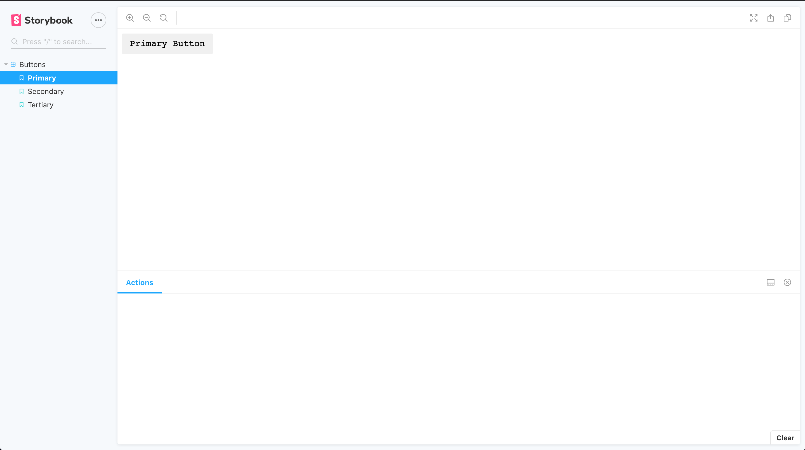
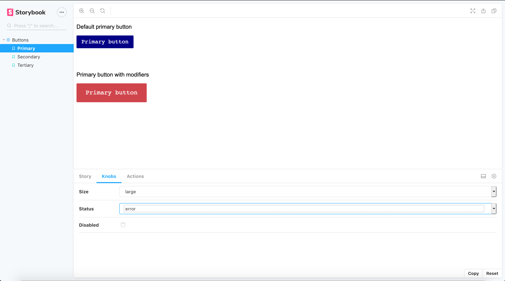
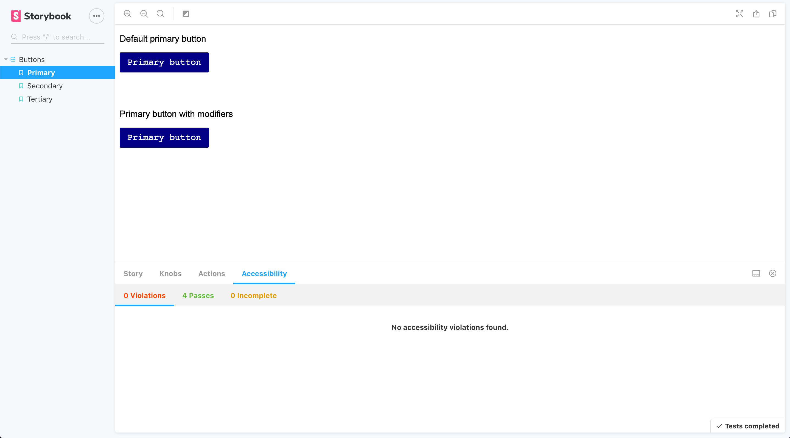

# Documenting With Storybook

## Storybook

Storybook allows you to document components in isolation. While there are many uses and benefits above and beyond simply documenting your components, this is how we'll be using it today.

## Initializing Storybook

To add Storybook to our design system, let's run the following command.

```jsx
npx -p @storybook/cli sb init
```

This will create a `.storybook` directory in the root of your project.

It will also create a `stories/` directory inside of the `src/` folder. If we expand it, we'll see `0-Welcome.stories.js` and `1-Button.stories.js`.

Run `yarn storybook` to start your development server.

We can delete the `0-Welcome.stories.js` file and rename the `1-Button.stories.js` file to `Button.stories.js`.

Inside `Button.stories.js` change the content to the following:

```jsx
import React from "react";
import {
  PrimaryButton,
  SecondaryButton,
  TertiaryButton
} from "../components/Buttons";

export default {
  title: "Buttons"
};

export const Primary = () => (
  <PrimaryButton>Primary Button</PrimaryButton>
);

export const Secondary = () => (
  <SecondaryButton>
    Secondary Button
  </SecondaryButton>
);

export const Tertiary = () => (
  <TertiaryButton>Tertiary Button</TertiaryButton>
);
```

If you go back to the UI we can see it's rendering a button but it isn't styled appropriately.

This is because our buttons rely on a theme prop to be passed with `ThemeProvider`.



## Passing Themes To Storybook Components

Inside `Button.stories.js` let's first import a few additional things.

```jsx
/* underneath react and buttons import statements */
import { ThemeProvider, ThemeContext } from "styled-components";
import { defaultTheme } from "../utils";
```

Then, we'll create a `Theme` variable which will create context for our theme.

```jsx
const Theme = ({ children }) => {
  useContext(ThemeContext);
  return children;
};
```

Next, we'll tell storybook how we'd like our yet-to-be-created stories to be scaffolded.

```jsx
export default {
  // Place all of this stories in this file inside of a "Buttons" folder
  title: "Buttons",
  // Wrap (decorate) our stories with our ThemeProvider using our default theme
  decorators: [
    storyFn => <ThemeProvider theme={defaultTheme}>{storyFn()}</ThemeProvider>
  ]
};
```

Now let's use our Theme component alongside our button stories.

```jsx
export const Primary = () => (
  <Theme>
    <PrimaryButton>Primary button</PrimaryButton>
  </Theme>
);

export const Secondary = () => (
  <Theme>
    <SecondaryButton>Secondary button</SecondaryButton>
  </Theme>
);

export const Tertiary = () => (
  <Theme>
    <TertiaryButton>Tertiary button</TertiaryButton>
  </Theme>
);
```

Now your UI should be appearing as expected.
## Addons

Addons are neat packages you can install and use with Storybook to gain additional functionality.

### Actions

We can also use the `action` function from `storybook/addon-actions` to dispatch actions when our button is clicked. This will simply log the event in the Storybook console.

```jsx
export const Primary = () => (
  <Theme>
    <PrimaryButton onClick={action("click")}>Primary button</PrimaryButton>
  </Theme>
);
```

### Code Snippets

Often you want to see the code snippets documented with your components. We can use the `story source` add-on to do this.

First add the add-on as a dependency with `yarn`.

```jsx
yarn add --dev  @storybook/addon-storysource
```

Next, add it to the `main.js` file in the `addons` array.

```jsx
"@storybook/addon-storysource";
```

You should now see code in your UI!

### Knobs

Knobs are a great add-on for testing all combinations of your components.

Simply install the add-on.

```jsx
yarn add --dev @storybook/addon-knobs
```

And add it to your `addons` array in `main.js`.

```js
"@storybook/addon-knobs";
```

We want to create knobs, or select drop downs, which allow us to choose our button size and status color as well as toggle the disabled state.

Inside `Button.stories.js` import the following.

```jsx
import { withKnobs, select, boolean } from "@storybook/addon-knobs";
```

Next, add `withKnobs` to the `decorators` array.

```jsx
export default {
  title: "Buttons",
  decorators: [
    storyFn => <ThemeProvider theme={defaultTheme}>{storyFn()}</ThemeProvider>,
    withKnobs
  ]
};
```

First let's create our default primary button which will show the primary button in its natural state. We'll give it a bottom margin so it doesn't collide with the elements below it.

Inside the `PrimaryButton` story add the following.

```jsx
<Theme>
  <p style={{ fontFamily: "Arial" }}>Default primary button</p>
  <PrimaryButton style={{ marginBottom: "50px" }} onClick={action("clicked")}>
    Primary button
  </PrimaryButton>
  <br />
</Theme>
```

Now let's create another primary button which will accept our modifiers.

There will be two items in our `modifiers` array: two select boxes with size and status. Size will contain `small` and `large` as values and status will contain `warning`, `error`, and `success`.

Then we can add the `disabled` state and set it to a `boolean` initialized to `false`.

```jsx
<Theme>
  <p style={{ fontFamily: "Arial" }}>Primary button with modifiers</p>
  <PrimaryButton
    modifiers={[
      select("Size", ["small", "large"]),
      select("Status", ["warning", "error", "success"])
    ]}
    disabled={boolean("Disabled", false)}
    onClick={action("clicked")}
  >
    Primary button
  </TertiaryButton>
</Theme>
```

Now when you change the knobs, the second primary button should change to reflect it.



### Accessibility

Now let's add an accessibility add-on. First add the package dependency.

```jsx
yarn add @storybook/addon-a11y --dev
```

Then add the add-on to the add-on array in `main.js`.

```jsx
module.exports = {
  stories: ["../src/**/*.stories.js"],
  addons: [
    "@storybook/preset-create-react-app",
    "@storybook/addon-actions",
    "@storybook/addon-links",
    "@storybook/addon-storysource",
    "@storybook/addon-knobs",
    "@storybook/addon-a11y/register"
  ]
};
```

Inside `Button.stories.js` import the accessibility add-on.

```jsx
import { withA11y } from "@storybook/addon-a11y";
```

And add it to the decorators array.

```jsx
export default {
  title: "Buttons",
  decorators: [
    storyFn => <ThemeProvider theme={defaultTheme}>{storyFn()}</ThemeProvider>,
    withKnobs,
    withA11y
  ]
};
```

And now you can see the accessibility panel appear in Storybook.



## Activity

Now it's your turn. Go ahead and add stories for your secondary and tertiary buttons as well as your modal.

Storybook is a great way to find bugs in your corner-cases! If you find any bugs in your CSS, go ahead and fix them!

### Activity Solution

```jsx
export const Secondary = () => (
  <Theme>
    <p style={{ fontFamily: "Arial" }}>Default secondary button</p>
    <SecondaryButton
      style={{ marginBottom: "50px" }}
      onClick={action("clicked")}
    >
      Secondary button
    </SecondaryButton>
    <br />
    <p style={{ fontFamily: "Arial" }}>Secondary button with modifiers</p>
    <SecondaryButton
      modifiers={[
        select("Size", ["small", "large"]),
        select("Status", ["warning", "error", "success"])
      ]}
      disabled={boolean("Disabled", false)}
      onClick={action("clicked")}
    >
      Secondary button
    </SecondaryButton>
  </Theme>
);

export const Tertiary = () => (
  <Theme>
    <p style={{ fontFamily: "Arial" }}>Default tertiary button</p>
    <TertiaryButton
      style={{ marginBottom: "50px" }}
      onClick={action("clicked")}
    >
      Tertiary button
    </TertiaryButton>
    <br />
    <p style={{ fontFamily: "Arial" }}>Tertiary button with modifiers</p>
    <TertiaryButton
      modifiers={[
        select("Size", ["small", "large"]),
        select("Status", ["warning", "error", "success"])
      ]}
      disabled={boolean("Disabled", false)}
      onClick={action("clicked")}
    >
      Tertiary button
    </TertiaryButton>
  </Theme>
);
```

For the modals don't forget to pass state!

```jsx
import React, { useContext } from "react";
import { withKnobs } from "@storybook/addon-knobs";
import { withA11y } from "@storybook/addon-a11y";
import { SignInModal, SignUpModal } from "../components/";
import { ThemeProvider, ThemeContext } from "styled-components";
import { defaultTheme } from "../utils";

const Theme = ({ children }) => {
  useContext(ThemeContext);
  return children;
};

export default {
  title: "Modals",
  decorators: [
    storyFn => <ThemeProvider theme={defaultTheme}>{storyFn()}</ThemeProvider>,
    withKnobs,
    withA11y
  ]
};

export const SignUp = () => (
  <Theme>
    <SignUpModal showModal={true} setShowModal={null} />
  </Theme>
);

export const SignIn = () => (
  <Theme>
    <SignInModal showModal={true} setShowModal={null} />
  </Theme>
);
```

## Customizing Storybook

You can customize the look and feel of your Storybook environment if you plan to publish it for your company to use.

First create a `manager.js` file inside of `.storybook/`. You can import `themes` from `@storybook/theming` if you want to use their `light` or `dark` themes.

```jsx
import { addons } from "@storybook/addons";
import { themes } from "@storybook/theming";

addons.setConfig({
  theme: themes.light
});
```

Or you can create your own theme by creating a new JavaScript file, adding the following customizable properties, and importing and using your template inside of `manager.js`.

```jsx
import { create } from "@storybook/theming/create";

export default create({
  base: "light",

  colorPrimary: "hotpink",
  colorSecondary: "deepskyblue",

  // UI
  appBg: "white",
  appContentBg: "silver",
  appBorderColor: "grey",
  appBorderRadius: 4,

  // Typography
  fontBase: '"Open Sans", sans-serif',
  fontCode: "monospace",

  // Text colors
  textColor: "black",
  textInverseColor: "rgba(255,255,255,0.9)",

  // Toolbar default and active colors
  barTextColor: "silver",
  barSelectedColor: "black",
  barBg: "hotpink",

  // Form colors
  inputBg: "white",
  inputBorder: "silver",
  inputTextColor: "black",
  inputBorderRadius: 4,

  brandTitle: "My custom storybook",
  brandUrl: "https://example.com",
  brandImage: "https://placehold.it/350x150"
});
```

```
import { addons } from "@storybook/addons";
import myTheme from "./myTheme";

addons.setConfig({
  theme: myTheme
});

```

## Building Storybook

You can run `yarn build-storybook` to build your storybook documentation and then you can deploy it for all team members to use.

## Resources

- [Storybook](https://storybook.js.org/)
- [Setting up Storybook with Material UI and Styled Components](https://medium.com/encode/setting-up-storybook-with-material-ui-and-styled-components-5bdacb6db866)
