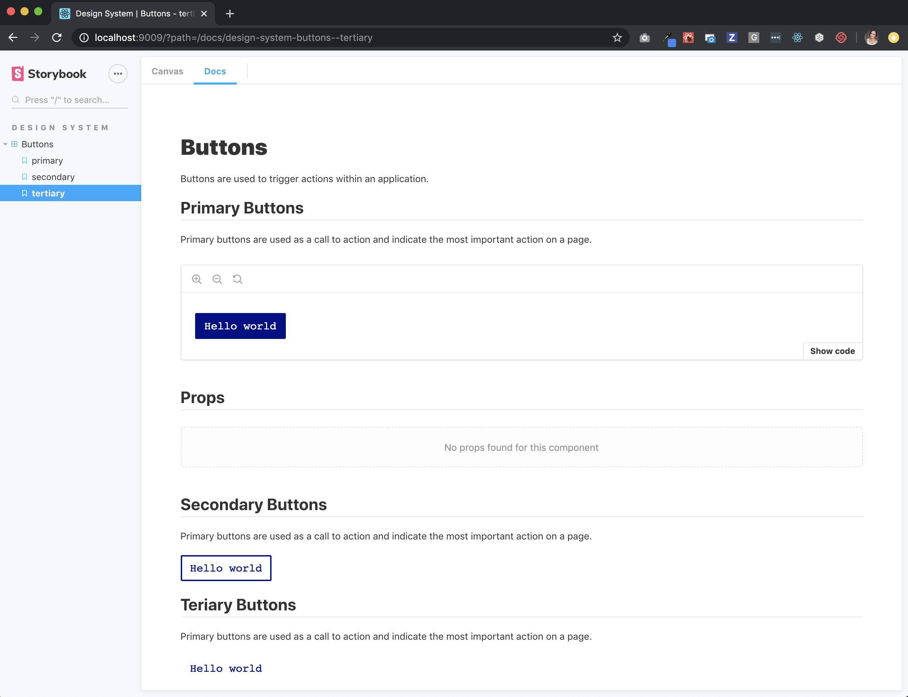
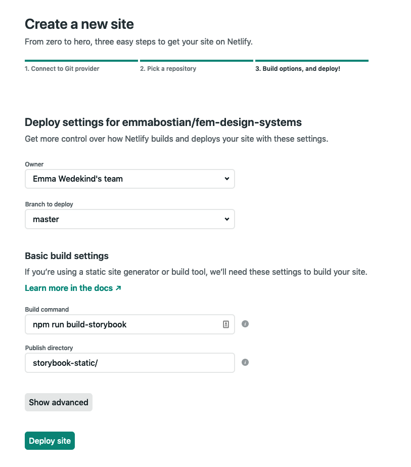

# Documenting With Storybook

## Storybook

Storybook allows you to document components in isolation. While there are many uses and benefits above and beyond simply documenting your components, this is how we'll be using it today.

## Initializing Storybook

To add Storybook to our design system, let's run the following command.

```jsx
npx -p @storybook/cli sb init
```

This will create a `.storybook` directory in the root of your project.

It will also create a `stories/` directory inside of the `src/` folder. If we expand it, we'll see `0-Welcome.stories.js` and `1-Button.stories.js`.

Run `npm run storybook` to start your development server.

We can delete the `0-Welcome.stories.js` file and rename the `1-Button.stories.js` file to `Button.stories.mdx`. Let's move this file into the `components/` directory so it's close to it's component. We can then delete the `stories/` folder entirely.

Storybook creates the `stories/` folder initially because it isn't aware of your project architecture. But we're aware of it so let's refactor.

## Creating Stories With MDX

MDX is a format which lets you write JSX in your markdown files, and we can use it to create stories and documentation.

Inside `main.js` change the file extension in the `stories` array to accept either `js` or `mdx`.

```js
stories: ["../src/**/*.stories.(js|mdx)"],
```

We can use MDX to document our components and create a style guide for our design system. To do that, we'll need a few additional things, known as add-ons.

## Using Add-ons

Add-ons are neat packages you can install and use with Storybook to gain additional functionality.

Let's add a documentation add-on which will allow us to create beautiful design system documentation.

Run the following command to install the docs add-on.

```
npm i -D @storybook/addon-docs
```

We then need to tell Storybook that we'll be using this add-on and we can do that in `main.js`.

Add the following to the `addons` array in `main.js`.

```js
module.exports = {
  stories: ["../src/**/*.stories.(js|mdx)"],
  addons: [
    ...{
      name: "@storybook/addon-docs",
      options: {
        configureJSX: true
      }
    }
  ]
};
```

The configureJSX option is useful when you're writing your docs in MDX and your project's babel config isn't already set up to handle JSX files. Now we can use our documentation add-on.

## Passing Themes

At the moment, Storybook is unaware of our theme, so our components aren't rendering with the correct styling.

To pass the theme prop to our components we have to do a bit of configuration.

In the `.storybook/` directory create a new file called `themeDecorator.js`. Decorators are wrapper components or Storybook decorators that wrap a story.

We'll need `ThemeProvider` from `styled-components` and for now we'll use our `defaultTheme`, which we can import from the `utils/` folder. We'll export a constant called `ThemeDecorator`. `ThemeDecorator` will take a story function as an argument and return a single JSX element, `ThemeProvider`.

`ThemeProvider` takes one prop, the theme (in our case the `defaultTheme`). As a child of the `ThemeProvider` component we'll evaluate the expression `storyFn()`.

```js
import React from "react";
import { ThemeProvider } from "styled-components";
import { defaultTheme } from "../src/utils";

const ThemeDecorator = storyFn => (
  <ThemeProvider theme={defaultTheme}>{storyFn()}</ThemeProvider>
);

export default ThemeDecorator;
```

Now that we have our theme provider, we need to configure it. Create a new file, `config.js` inside of the `.storybook` directory, and add the following.

```js
import { addDecorator } from "@storybook/react";
import themeDecorator from "./themeDecorator";

addDecorator(themeDecorator);
```

Now, all of our components will receive our theme prop, which is currently set to `defaultTheme`.

## Writing The Button Stories

We're finally ready to add some button documentation. Inside `Buttons.stories.mdx`, add the following:

```jsx
import { Meta, Story, Props, Preview } from "@storybook/addon-docs/blocks";
import {
  PrimaryButton,
  SecondaryButton,
  TertiaryButton,
  Button
} from "./Buttons";

<Meta title="Design System|Buttons" component={PrimaryButton} />

# Buttons

Buttons are used to trigger actions within an application.

## Primary Buttons

Primary buttons are used as a call to action and indicate the most important action on a page.

<Preview withToolbar>
  <Story name="primary">
    <PrimaryButton>Hello world</PrimaryButton>
  </Story>
</Preview>

## Secondary Buttons

Primary buttons are used as a call to action and indicate the most important action on a page.

<Story name="secondary">
  <SecondaryButton>Hello world</SecondaryButton>
</Story>

## Teriary Buttons

Primary buttons are used as a call to action and indicate the most important action on a page.

<Story name="tertiary">
  <TertiaryButton>Hello world</TertiaryButton>
</Story>
```

Now if we restart our Storybook server, we should see our buttons rendering in the UI. We also have a Docs tab which houses all of our documentation.



## Knobs

## Accessibility

## Modal Activity

## Theme toggling

## Customizing Storybook

You can customize the look and feel of your Storybook environment if you plan to publish it for your company to use.

First create a `manager.js` file inside of `.storybook/`. You can import `themes` from `@storybook/theming` if you want to use their `light` or `dark` themes.

```jsx
import { addons } from "@storybook/addons";
import { themes } from "@storybook/theming";

addons.setConfig({
  theme: themes.light
});
```

Or you can create your own theme by creating a new JavaScript file, adding the following customizable properties, and importing and using your template inside of `manager.js`.

```jsx
import { create } from "@storybook/theming/create";

export default create({
  base: "light",

  colorPrimary: "hotpink",
  colorSecondary: "deepskyblue",

  // UI
  appBg: "white",
  appContentBg: "silver",
  appBorderColor: "grey",
  appBorderRadius: 4,

  // Typography
  fontBase: '"Open Sans", sans-serif',
  fontCode: "monospace",

  // Text colors
  textColor: "black",
  textInverseColor: "rgba(255,255,255,0.9)",

  // Toolbar default and active colors
  barTextColor: "silver",
  barSelectedColor: "black",
  barBg: "hotpink",

  // Form colors
  inputBg: "white",
  inputBorder: "silver",
  inputTextColor: "black",
  inputBorderRadius: 4,

  brandTitle: "My custom storybook",
  brandUrl: "https://example.com",
  brandImage: "https://placehold.it/350x150"
});
```

```
import { addons } from "@storybook/addons";
import myTheme from "./myTheme";

addons.setConfig({
  theme: myTheme
});

```

## Deploying Storybook

You can run `npm run build-storybook` to build your storybook documentation and then you can deploy it for all team members to use.

Once built, commit and push all of your repository code to the `master` branch.

Next head over to [Netlify](https://www.netlify.com/) and log in, or sign up, with GitHub. Click New Site From Git and select GitHub for continuous deployment, then select your repository.

Leave the owner as your default team, and the branch to deploy to `master`. Under Basic build settings, set the following arguments:

```
// Build command
npm run build-storybook

// Publish directory
storybook-static/
```



Once the deploy has started, you can then head over to the site settings and change the site name. Netlify makes it super easy to add a custom domain with the Domain management panel. You can read more about adding a custom domain [here](https://docs.netlify.com/domains-https/custom-domains/).

## Resources

- [Storybook](https://storybook.js.org/)
- [Setting up Storybook with Material UI and Styled Components](https://medium.com/encode/setting-up-storybook-with-material-ui-and-styled-components-5bdacb6db866)
