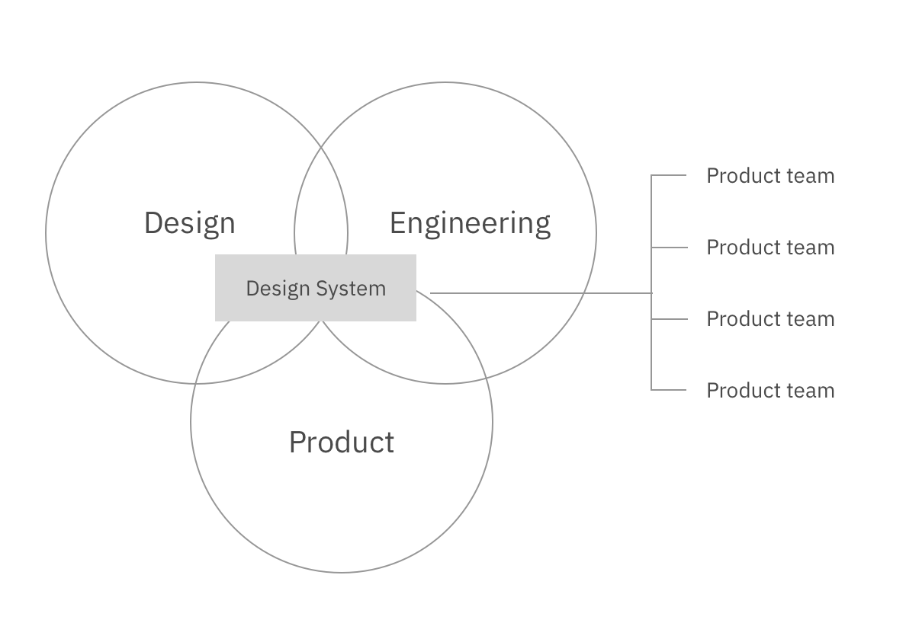
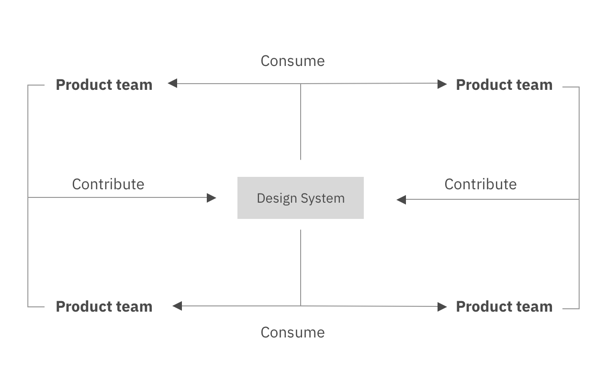
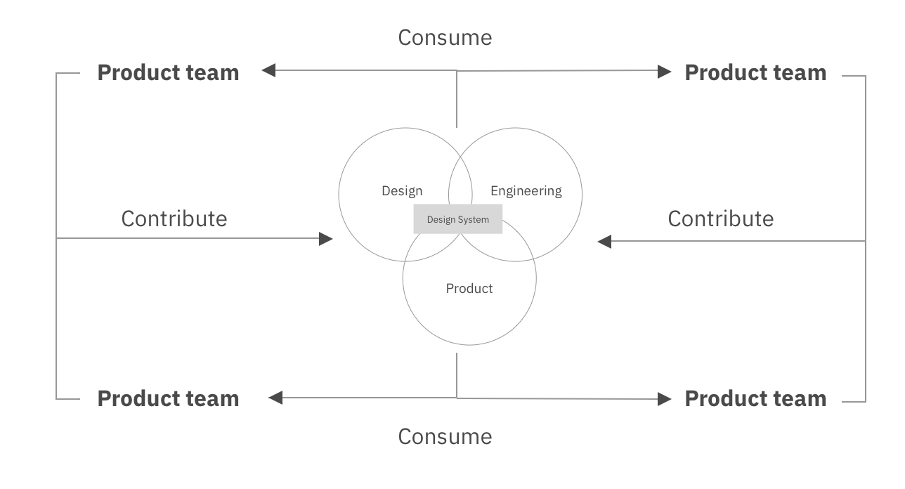

# Foundations Of Design Systems

The internet was not originally intended to host large-scale social and enterprise applications; it was built as a method for sharing data all across the world.

Yet much of the terminology we've coined in regards to web development has its roots in printed books. Webpages, bookmarking, and pagination all allude to a time when printed media was king.

This era is long gone.

Digital media has taken over as the primary resource for sharing and digesting content.

We don't develop websites as full pages anymore, which poses a problem. When we associate websites with the concept of pages, subconsciously we throw re-usability out the window; nothing about the word page indicates re-usability. And when we don't re-use our code consistency, accessibility, and development speed suffer.

Instead of thinking in terms of pages, we should be thinking in terms of components. Components allow us to maintain consistent user interfaces which are accessible by nature. And design systems are the way in which we can create these sets of reusable patterns and components.

Design systems allow us to create a cohesive experience throughout every leg of a user's journey.

## What Is A Design System?

There is no industry definition for a design system, which can make it a bit tricky to understand.

If you hear a designer say design system, they're most likely referring to the design language and UI kit.

If you hear a developer say design system, they're probably referring to the component library or style guide.

But a design system encompasses all of these things: design language, UI Kit, component library, and style guide.

## Why Design Systems Matter

Design systems allow companies to define their own brand identity and bake it into accessible, consistent, and re-usable components, and this comes with many benefits.

### Accessibility

Everyone, regardless of circumstance, should be able to achieve the same results from your application.

Design systems ensure that your application has a color palette with sufficient contrast ratios, typography scales with large enough text sizes, and easy-to-digest content. It also ensures that all of the components within your web application can be used with just a keyboard, that important alerts are read by screen readers, and landmark regions are denoted.

### Consistency

Design systems facilitate consistency. We live in an era where it's common for one company to own many sister products, or suites of products, with similar brand identities.

Take Google for example. They have a suite of products that look and feel like they come from the same family. I can use Google Drive, Maps, and Flights and will see the same web components each time.

And when your company owns a suite of products similar to Google, consistency is key.

### Trickle-Down Updates

Trickle-down style updates is another huge benefit of design systems. When a design pattern is updated, developers no longer have to sync cross-squads to implement this change.

The style can be updated in one component within the system, and will propagate to each product with just a quick update to the library package.

### Responsiveness

Responsiveness. Design systems are built to be responsive. Mobile devices account for about half of all web traffic, worldwide.

Our web applications must account for different screen resolutions and devices. Design systems ensure that they do.

### Onboarding

Streamlined on-boarding. This benefit is two-fold. Having a well-documented design system ensures that new team members can be onboarded quickly and efficiently. There is one place for them to go to get all of the information they need to get started.

Additionally, design systems facilitate better cross-squad collaboration. If all squads are using the same system, developers from squad A can easily jump into squad B to help with a feature or bug.

### Flexibility

Flexibility. And you're probably a bit confused by this as I've just harped on the importance of consistency. But design systems must be flexible and provide serve different teams and different use cases. However they must establish boundaries within which teams can customize.

We need variations of our components such as small, medium, and large sized buttons or buttons with icons. A design system must serve a variety of use cases, while setting parameters on what exactly those use cases can be.

### Speed

Once the system has had a stable release, designers can use the UI Kit to rapidly prototype designs and developers can use the component library to rapidly develop these new designs.

## Drawbacks Of Design Systems

But while all of these benefits sound great, there are some drawbacks as well.

### Time

We've all heard the saying that "Rome wasn't built in a day" and your design system won't be either.

Design systems take time to build. We're not talking a month or two. A robust design system built from the ground up can take many months to several years to be stable. This is all dependent on your team structure.

### Evolution

A design system is never complete. It isn't a project with a finite end date; it's a product serving products and it will evolve over time.

### Maintenance

A design system is not a project with a release date. A design system is a living, breathing product which has lifecycles and requires maintenance.

And we cannot build a design system without a team.

### Investment

Stakeholders don't like hearing that a design system requires a large, up-front commitment, but that's the reality.

We need designers, engineers, and product managers to ensure the success of the system.

And given all of these downsides, the number one reason design systems fail is a lack of adoption.

## Design System Team Structure

There are three different team-structures with which you can build a design system and hopefully promote adoption.

### Centralized Model

The first type of team structure is the centralized model. A core group of members are autonomous in running and maintaining the design system.

They will

- Define the foundation & identity of the system
- Have veto power over the system
- Manage & create the UI kit, component library, and style guide

The team structure is cross-disciplined. You'll need members from design, engineering, and product in order to build a sustainable and scalable system.

### Distributed Model

In contrast, we have the distributed model which doesn't leverage a core team, but instead is built and maintained by the teams using the system itself.

The distributed model instills a sense of ownership within all contributing design system members. And people are more passionate about something when they have a hand in creating it.

Additionally, the system will be influenced by many different vantage points leading to more collaboration and potentially more innovation.

Finally, as it's being built by the teams using it, progress doesn't stop if one core member is unavailable.

In this team model we can see that there is no centralized or core team building the system; the teams which consume the system are simultaneously contributing to the system.

### Hybrid Model

Lastly is the hybrid model, which combines the centralized and distributed team models.

This method is the most effective as decisions are made quickly and development of the design system is streamlined due to community contribution.

## Who Are Design Systems For?

Open-source design systems aren't necessarily meant for public consumption.

"If a design system is by a company, then it's for the company. It might also be open source, but any ol' random developer who wants to use it isn't the target audience." - Chris Coyier

While you might open source your design system, and technically anyone can clone and use your system, that's not the intended use. Design systems are meant for internal consumption. We open source our design systems to share knowledge and best practices.

## A Practical Example

Nathan Curtis, a very prominent speaker within design systems, has a great blog post titled ["And you thought buttons were easy."](https://medium.com/eightshapes-llc/and-you-thought-buttons-were-easy-26eb5b5c1871) I'd like to share some of his insight with you today, because I think it will really drive the point home.

We're all familiar with buttons. They're not too hard to make, right? As engineers we can sometimes forget how complex a comprehensive button component truly is from its birth within the design process all the way to its coming of age within quality assurance.

Padding, margin, border radius, background color, font size, font family, color, and font weight. These are all factors that go into building a button. And since button elements are one of the most frequently used elements throughout a web application, they can truly impact your brand identity.

But we're not finished yet. We can't just worry about the physical properties of a button in its neutral state. We have to make considerations for hover, focus, active, and disabled states.

Web applications aren't typically built with just one type of button. So we need more than just a primary button. We also need secondary and tertiary buttons.

And we can't forget about icons! We need primary, secondary, and tertiary buttons with icons and text, as well as without text.

We also can't forget about light and dark themes. Many enterprise products will have a variation on color palette, so our buttons must work across all themes.

OH and we may need different sized buttons.

And now, we're finally complete. At least we're complete with the design.

Let's now associate some numbers with this whole process.

Suppose we have a designer, engineer, and quality assurance engineer working to design, build, and test these buttons.

Averaging each team member at a cost of about $100 per hour, and assuming they spend about 200 hours on the entirety of this process, which is only about 66.6 hours of work per team member, or just over a week and a half, this totals a cost of $20,000.

\$20,000 to create buttons.

And that's just one team creating this library.

If your enterprise company has 50 teams each designing, building, and testing buttons, that's a grand total of \$1 million you're spending on buttons.

And since they're all being built by different teams, you can bet that the quality will vary with each version.

This is why you need a design system.

Let's break down the three pillars of design systems. We'll start with the design language.

## Three Pillars of Design Systems

### Design Language

A design language is the set of standards and assets which guide the creation of a suite of products underneath a brand. I like to think of a design language as the personality of a brand and its corresponding design assets.

A design language is comprised of two areas:

- Foundation
- Components

The foundation is comprised of the principles which describe how your design language should be leveraged to build products. It includes things such as:

- Accessibility
- Brand
- Color
- Typography
- Spacing
- Grid
- Motion
- Icons
- Content

### Component Library

A component library is the set of components which turn the design language and UI Kit into living, breathing code.

Component libraries can be built with many different frameworks and libraries (sometimes more than one) such as Angular, Vue, and React. Native web components are also a great example when thinking about building a component library.

### Style Guide

The style guide is the documentation for the design language, UI kit, and component library.

There are many different ways to build a style guide.

Perhaps you just need component documentation, so publishing your Storybook site is enough for your team.

Or maybe you want a fully-fledged website.

Gatsby is a great option, if you know React, and can be used to create beautiful style guides using markdown.

The [Invision DSM](https://www.invisionapp.com/design-system-manager) is a CMS solution for creating a style guide if you don't have a ton of time or resources.

## Building A Design System

Before you build anything tangible you should start by defining your design principles.

### Design Principles

Design principles are the grounding values and principles which drive the creation of your products.

Atlassian's design principles are "bold, optimistic, and practical."

Design principles must support the global vision of your product and express its identity. What do you want your users to feel when using your product?

Once we've defined our design principles, we're ready for a UI audit.

### UI Audit

Most of us are not working on a brand new product; often there is legacy code and UI to handle. This is where a UI audit comes in.

Take screenshots of all components in your products, in each state and group them visually in one location by functionality.

We're not grouping by visual similarity but by functionality because visual design patterns evolve, but the underlying behavior remains.

Aggregate all components in one place, whether it's a Sketch or Figma file, or a Google doc.

Next, we prioritize.

Which components will have the highest impact on the unification of your product? How feasible is this component to build? Prioritize the highest-impact and highest-feasibility elements first.

Product, design, and engineering should answer questions which evaluate whether or not this design system change should be accepted, and if so, how it should be prioritized.

We need to examine the impact of incorporating this change from a multitude of vantage points.

Some questions you may want to ask are:

- Does this request embody our design principles?
- Does this requires require a lot of design/development effort?
- Does this request come with a high risk to the success of our product?
- Does this request coincide with our product roadmap?
- Does this request require a lot of maintenance?
- Does this request improve the user experience of our products?
- Are we confident in this request or will it need to be revisited agin in the near future?
- Is this request technically feasible?

We can take these questions and turn them into impact statements.

These impact statements will coincide with one of six metrics. We can do this by creating impact statements with regards to three adoption metrics and three opposition metrics.

The adoption metrics are: impact, identity, and confidence.

The opposition metrics are: maintenance, risk, and effort.

In order to determine whether we should incorporate this change or component into our design system, we must evaluate the benefits of employing this change against the negatives.

Product, design, and engineering will evaluate this proposal by rating the change against the impact statements.

Once all surveys have been taken, we can average the responses from the adoption metrics and the responses from the opposition metrics, and turn them into x and y coordinates.

Finally can take this request and plot it within our four-quadrant graph.

This process is complex and comes with overhead, which is why it shouldn't necessarily be carried out for each request. We can use this method if the team comes to a standstill.

## Sprint Process

The process for building a new component in our design system looks like this:

1. Design
2. Develop
3. Test
4. Document
5. Deploy

When building a system, we must be intentional when choosing a technology stack. We must meet teams where they are today. So if your teams are using Vue.js, don't build a component library using React styled components.

This is an iterative process that will be revisited for each component.

## Checklist

Before a component is considered complete, it must meet several design and development requirements:

### Design Requirements

#### Accessibly

All users, regardless of circumstance, must be able to accomplish the same tasks within our product. Our designs must account for users with visual impairments and must ensure all facets are consumable.

#### Interaction

How should a component react when a user interacts with it? Is there validation feedback that must occur? The interaction definition must be defined.

#### Context

How and where should this component be leveraged? When should I use a link versus a tertiary button, for example?

#### Completion

Are all states, including neutral, hover, focus, and disabled, defined?

#### Content

What type of content does this component rely upon? Does it accurately embody the brand identity?

#### Customization

Are aspects of this component customizable? If so, how? For example, if my design system serves multiple products, the primary button might have a different background color for product A versus product B. We must define these customizable parameters.

#### Resolution

How does this component look on varying screen resolutions? How does the layout change?

### Development Checklist

#### Accessibility

In addition to an accessible color palette, we must develop our components with semantic HTML elements in order to ensure compliance with assistive technologies. We also must account for keyboard navigation.

#### Responsiveness

Our components must respond to browser window resizing.

#### Completion

Does this component account for all aspects of the design? Have we implemented a near pixel-perfect component?

#### Customization

Have we implemented all of the customizable aspects of this component?

#### Error Handling / Data Validation

How do our components respond when something breaks? Have we incorporated type checking with React Prop Types or TypeScript to ensure our parameters comply with expected data types?

#### Browser Compatibility

Do the technologies we use work across all supported browsers or must we employ polyfills?

## Common Mistakes

There are some common pitfalls you might run into when creating a design system.

### Starting For Scale

While the ability to scale is good, building your components **for** scale can be a detriment.

Only scale when needed.

### Educating Before Building

Educating your teams about your design system can negatively impact your rapport if there's nothing to use. Ensure you have something designed and built before educating so that designers and developers can jump right in.

### Not Discussing Workflow

If you going to be collaborating on a design system, it's important to come to terms on a working model. You even might want to create a social contract.

### Not Documenting Decisions

Design systems require a lot of investment and will often have lots of eyes on them. Documenting decisions will save you and your team the headache of having to explain to each stakeholder why you're doing something a certain way.
